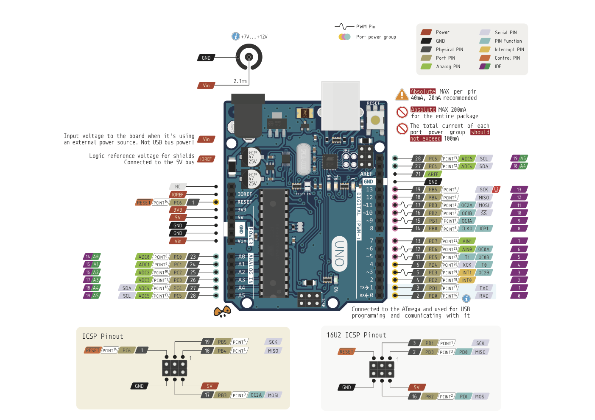

# TrustLens 
Arduino files to manage the TrustLens' LED system.
# Pinout
Pinout schematic for the board for the future reference. Used board is **Arduino Uno R3**

# Useful resources
- [For calculating resistance of a resistor.](https://www.digikey.co.uk/en/resources/conversion-calculators/conversion-calculator-resistor-color-code-4-band)

# Room distribution
- Alarm - Blue cable - Pin 11
- Bathroom - Orange cable - Pin 10
- Fridge - Green cable - Pin 9
- Lounge - Purple cable - Pin 8
- Kid's room - Yellow cable - Pin 7
- Door - Red cable - Pin 6

# Constants
**Delay** - If you want to change how big the delay between each instruction is, modify line 13:
```
const int waitTime = X;
```
Where `X` is the delay in milliseconds

**Pinouts** - If for any reason you would like to rearrange the pins that each room corresponds to, they are located between line 5 and 10:
```
const int alarmPin = 11;
const int bathroomPin = 10;
const int fridgePin = 9;
const int loungePin = 8;
const int kidPin = 7;
const int doorPin = 6;
```
Make sure that the cables are plugged in to correct spots!